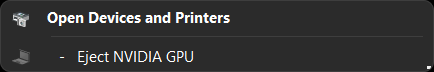
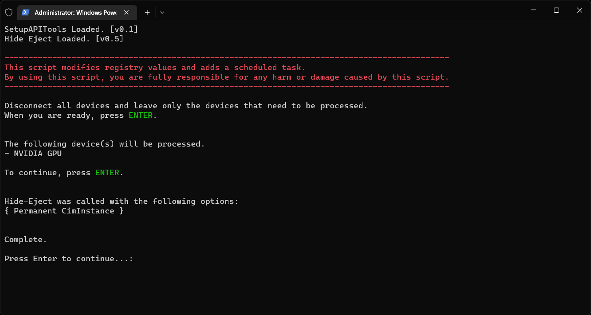

# Hide Eject

Hide devices from appearing in [Safely Remove Hardware](./img/problem_safeRemoval.png) list.

For example, you don't have to see this anymore:  


## Disclaimer

By using the provided scripts, you are fully responsible for any harm or damage caused by them.

## How to Use

An AutoFix script is implemented for simpler use.

1. Clone the repository and unzip it.
2. Run `Launch AutoFix.cmd`
3. Follow the instruction.
4. Done.

If you prefer a different method, see specifics below.

## Specifics

```
NAME
    Hide-Eject

SYNTAX
    Hide-Eject -InputObject <CimInstance#Win32_PnPEntity[]> [-Permanent] [-Rollback] [<CommonParameters>]

ALIASES
    None
```

## Screenshot

</br>
[AutoFix]

</br>
[Manually using HideEject]

## Resources

- [TenForums: How to Disable Eject Hardware](https://www.tenforums.com/drivers-hardware/128529-how-disable-eject-hardware-2.html#post1591718)
- [Dell: Safely Remove Hardware icon never goes away](https://www.dell.com/community/Storage-Drives-Media/Safely-Remove-Hardware-icon-never-goes-away/m-p/3871771#M316664)
- [TenForums: SATA HDD & SSD shown as removable](https://www.tenforums.com/drivers-hardware/103068-sata-hdd-ssd-shown-removable.html#post1277271)
- [Microsoft Support: Internal SATA Drives show up as removeable media](https://support.microsoft.com/en-us/topic/internal-sata-drives-show-up-as-removeable-media-1f806a64-8661-95a6-adc7-ce65a976c8dd)
- [superuser: Internal hard drives showing as removable in Windows 10](https://superuser.com/questions/1010792)
- [DEVPKEY_Device_SafeRemovalRequired](https://learn.microsoft.com/en-us/windows-hardware/drivers/install/devpkey-device-saferemovalrequired)
